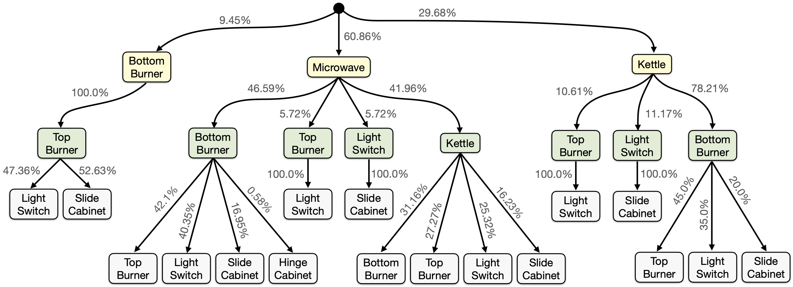

## Choosing Kitchen Target Tasks

In the kitchen environment a task defines the consecutive execution of four subtasks. 
Some subtask sequences can be more challenging for agents to learn than others. For SkiLD, as well as for SPiRL and any
other approach that leverages prior experience, the task complexity is mainly influenced by how well the respective
subtask transitions are represented in the prior experience data.

We use the training data of Gupta et al., 2020 for training our models on the kitchen tasks. 
The subtask transitions in this dataset are not uniformly distributed, i.e., certain subtask sequences are more likely
than others. Thus, we can define easier tasks in the kitchen environments as those that require more likely subtask
transitions. Conversely, more challenging tasks will require unlikely or unseen subtask transitions.

In the SkiLD paper, we analyze the effect of target tasks of differing alignment with the pre-training data
in the kitchen environment (Section 4.4). We also provide an analysis of the subtask transition probabilities in the
dataset of Gupta et al. (Figure 14, see below), which we can use to determine tasks of varying complexity.

</img>

### Changing the Kitchen Target Task

By default, the configs provided in this repository can be used to train a SkiLD agent on the 
`Kettle --> Bottom Burner --> Top Burner --> Slide Cabinet` task, whose transitions relatively well-represented in the
pre-training data. In order to change the target task, the value for `filter_indices` in the configs for training 
of the [skill posterior](../../../skild/configs/skill_posterior/kitchen/conf.py#L3) and 
[demonstration discriminator](../../../skild/configs/demo_discriminator/kitchen/conf.py#L35) need to be adjusted. 
These indices determine the sequences from the pre-training data that are used as demonstrations for the downstream task.

To obtain a mapping from the sequence of solved subtasks, and thus the task, to the trajectory indices, we provide 
[a scirpt](../../../skild/data/kitchen/kitchen_subtasks.py) that determines the subtask sequence for each of the 603 sequences in the pre-training dataset. 
If you want to change the target task, simply run this script, determine the indices for the desired subtask and adjust
the config files linked above. For example, for the challenging task 
`Microwave --> Light Switch --> Slide Cabinet --> Hinge Cabinet` used in the paper, the indices need to be changed to
`[190, 210]` for training of skill posterior and discriminator.

If you want to run RL on the new target task, you need to change the name of the Kitchen environment in the RL config 
accordingly, e.g., [HERE](../../../skild/configs/demo_rl/kitchen/conf.py#L185) from `kitchen-kbts-v0` to `kitchen-mlsh-v0`.

